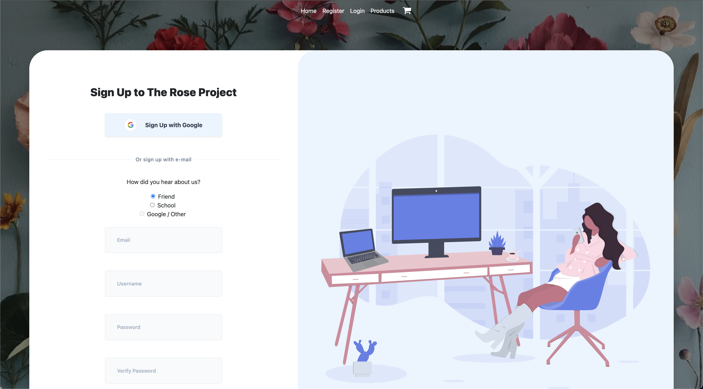

# Ecommerce Website - The Rose Project

The Rose Project is a website where I just put up what I do
in hopes of getting paid for it, well graded for it.

  
  
  
  
  

    
    Above is an interesting line of code that I wrote that allows for scroll snapping.
    If you want to see more of the code, check inside my css file and how i split my pages
    into sections.

